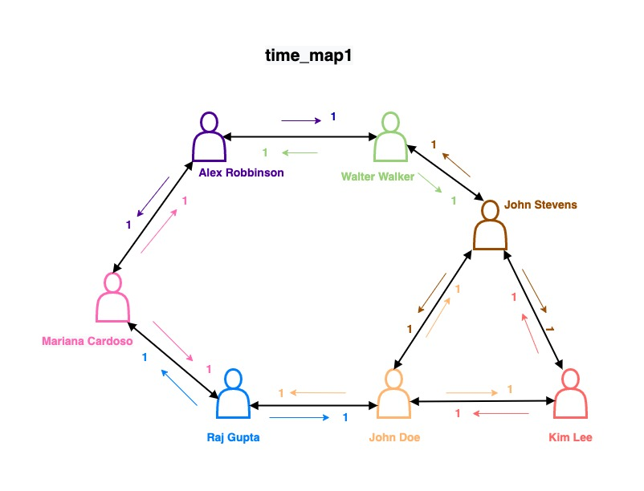
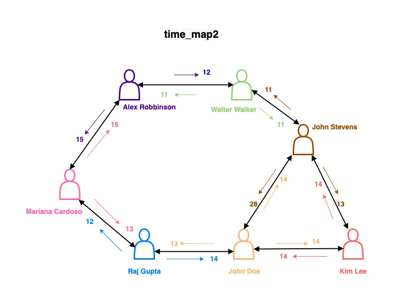
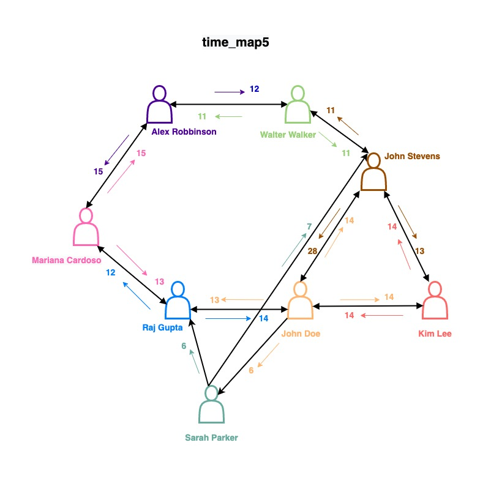
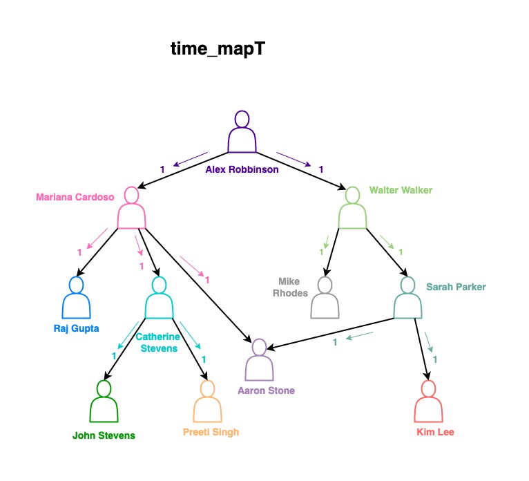
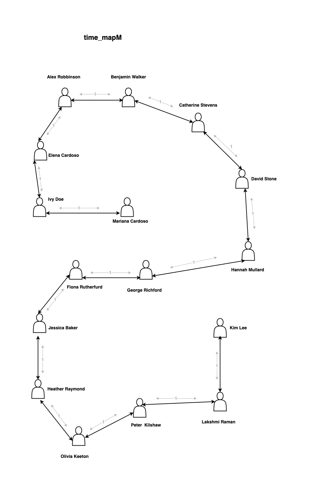

# HW1—Search

## Back Story

You work at a startup called FaceByte, which is a social network app. Willie and you, both alumni of Nerdwestern University, are part of the team responsible for social mapping. You take care of software engineering and Willie handles the rest. 

In social networks each user profile is treated as a node on the graph and two nodes are said to be connected if they are each other's friends. Your team is currently testing the “find friends” and “suggested friends” features of the app before its next update release (due next week). To ensure that the features on the app are yielding correct results Willie asked you to come up with a mapping/routing system. So you'll have to come up with something yourself and do it fast. 

Fortunately, you don’t have to apply and check for all users. If the mapping works for the given test users it is scalable and can be used in the app. You have relevant test case maps that encompass possible situations (loops and weightage) and thus require passing. For you, that means you only need to write three (3) more pieces of software before the launch: an implementation each of **Breadth-first Search (BFS)**, **Depth-first Search (DFS)**, and the **A\* algorithm** that all find the best way to recommend, find and suggest friends to users. You're implementing three algorithms because you want to eventually do a comparative analysis of all three to select the best one.

## Task Parameters

The test case maps are plugged in the a_star_gradingtests.py and main.py. For reference,  some (not all) of the test case maps are as follows, though the remaining test case maps differ only in the similarity point score values of time_map2 and retain the same structural path connectivity between user nodes:












Now, Willie understands the gravity of the task he's handed you. As such, he has supplied you with a few different maps you can use to develop the software. These maps can be found in the `a_star_gradingtests.py` file. The file also has tests that you can use to test your software. **Willie's only going to accept your work if your code passes all the tests.** Additionally, in order to test for robustness of your software, **Willie may also use some additional tests that he's not willing to show you now.** They will be different from the tests he's supplied you with but similar enough that if your implementation is correct, it should pass the unseen tests too as long as you don't obtain any shortcuts (e.g., hardcoding, writing code specifically aimed at passing the tests while not implementing the desired algorithm, etc.) 

Things to note about the maps:

1. If you look at the test functions, you'll see that certain tests use certain maps. Please be mindful of that.

2. The maps for DFS don't have any loops, so even if you don't keep a list of expanded nodes, you should be alright. Note that this means that once a node is expanded, it doesn't show up again further down that same branch. However, the same node can show up on different branches of the tree, which means in the entire search, the same node can be expanded more than once. In case you choose to keep track of expanded nodes, that should not prevent you from expanding a node that you already expanded on a different branch earlier.

3. The maps for BFS, however, may contain loops, so it's best to maintain a list of expanded nodes. Willie said the book *Artificial Intelligence: A Modern Approach*  has stuff about BFS.

4. Your algorithms will calculate the fastest (thinking shortest in time) route between any pairs of the landmarks.

5. Your A\* function will be given two routing maps as inputs. The first map specifies the connection path between two user nodes (Willie has already made the data entry); we will refer to this as the **distance map**. The second map is based on the user activity data from our archives. It specifies the common friends, common groups, similar posts liked, message activity to common friends, similar life events, etc. between two user nodes. Since it’s a metric of no. of times two users have similarity points established, we will refer to this as the **time map**. For all three implementations (BFS, DFS, and A\*), you will use the time differences between user nodes as the main metric, not distance. However, for A\*, you will use the connecting distance between user nodes as the **heuristic** (how far you're from one user). In other words, for A\*, the distance from the start user node to your current user node will be “time-based”, but the distance from your current node to the destination node will be “distance-based”.

When passed to your A\* implementation, both the distance map and the time map are stored in the same format (a Python dictionary). The following is an example time map.

```python
Time_map = {

'John_Stevens':	{'John_Stevens':None,'John_Doe':4,'Kim_Lee':3,'Raj_Gupta':None,'Walter_Walker':1,'Alex_Robbinson':None,'Mariana_Cardoso':None},
'John_Doe':
{'John_Stevens:4,'John_Doe':None,'Kim_Lee':4,'Raj_Gupta':3,'Walter_Walker':None,'Alex_Robbinson':None,'Mariana_Cardoso':None},

'Kim_Lee':
{'John_Stevens':4,'John_Doe':4,'Kim_Lee':None,'Raj_Gupta':None,'Walter_Walker':None,'Alex_Robbinson':None,'Mariana_Cardoso':None},

'Raj_Gupta':
{'John_Stevens':None,'John_Doe':4,Kim_Lee':None,'Raj_Gupta':None,'Walter_Walker':None,'Alex_Robbinson':None,'Mariana_Cardoso':2},

'Walter_Walker':
{'John_Stevens':1,'John_Doe':None,'Kim_Lee':None,'Raj_Gupta':None,'Walter_Walker':None,'Alex_Robbinson':1,'Mariana_Cardoso':None},

'Alex_Robbinson':
{'John_Stevens':None,'John_Doe':None,'Kim_Lee':None,'Raj_Gupta':None,'Walter_Walker':2,'Alex_Robbinson':None,'Mariana_Cardoso':5},

'Mariana_Cardoso':
{'John_Stevens':None,'John_Doe':None,'Kim_Lee':None,'Raj_Gupta':3,'Walter_Walker':None,'Alex_Robbinson':5,'Mariana_Cardoso':None}}
```

In this example, the similarity points between John Stevens and Kim Lee is `3`. `None` indicates that there is commonality (similarity points) between the two user nodes. Connection path mentioned above should be adhered to for an efficient and accurate friend suggestion and friend finding results that satisfy our users. Combining the no. of times similarity points are established between two users and the connecting distance between users, it is certain that the distance map can only be used as a heuristic for the A\* algorithm. It is also noteworthy that the no. of similarity points established on the two sides of the same connecting path is most likely different. This is due to the difference in weightage of similarity points established due to more general events, likes,etc. in one direction versus personal  events,likes,identity,etc. in other directions. We need to be mindful of considering more personal and likely friend suggestions and recommendations.

## Homework Deliverable

For this homework, you must implement all three (3) functions in `student_code.py`. Each function must return a path from user node `start` to user node `end`.

Note that:

* The result must be a list of strings. Each string contains _only_ the name of a user node. The order of the strings in the list denotes the order in which the user nodes are reached along the path;
* The result list should _begin_ with the name of the `start` user node and _terminate_ with the name of the `end` user node. (Thus, the connecting path from `A` to `A` is the list `[A]`);
* The cost of a path between two connected user nodes is the total expected similarity points, denoted as time, that must be taken into account while navigating and mapping through all user nodes in the specified order.  

Your `a_star_search` function must implement an A\* **graph** search algorithm, and it must use the `expand` function in `expand.py`. With the `expand` function, we can verify that the correct number of nodes are expanded. As a reminder, graph search algorithms do not expand nodes that have already been visited. 

Your BFS and DFS implementations will essentially be **tree** search algorithms operating on the graphs that the maps form.

Furthermore, the Autograder that Willie will use to test your code assumes that all of the code that is needed to properly grade your assignment submission is included in `student_code.py`. Please adhere to this constraint as you develop your response. 

Additionally, you should feel invited to use Python modules for your data structures, but you need to implement A\* yourself.
